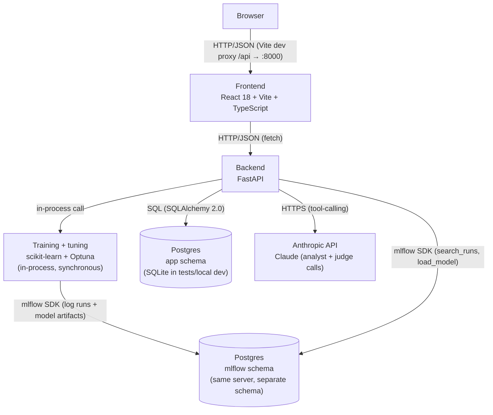
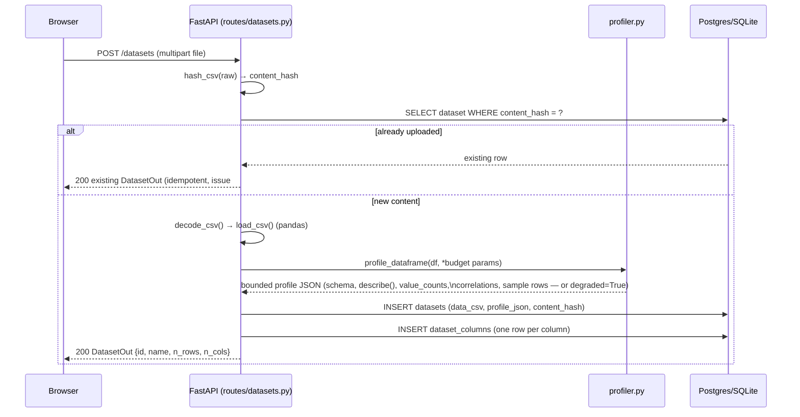
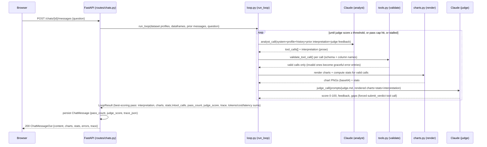
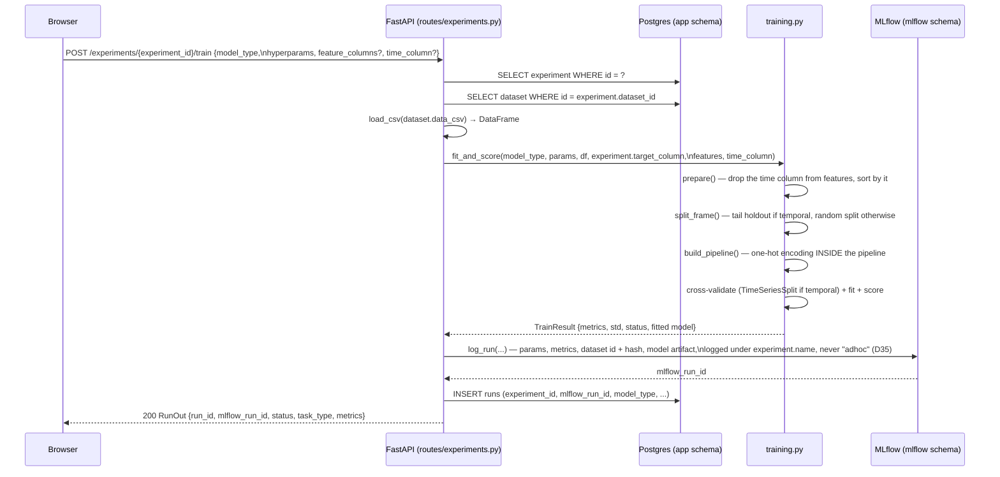
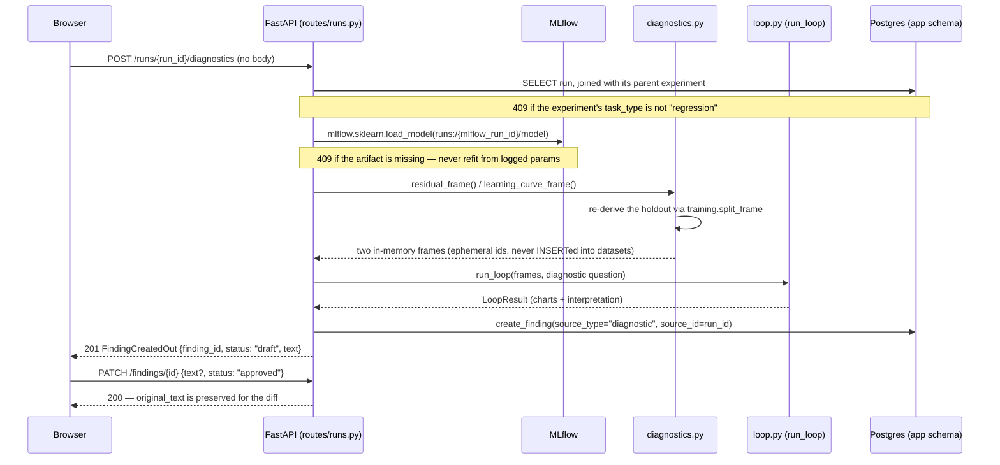
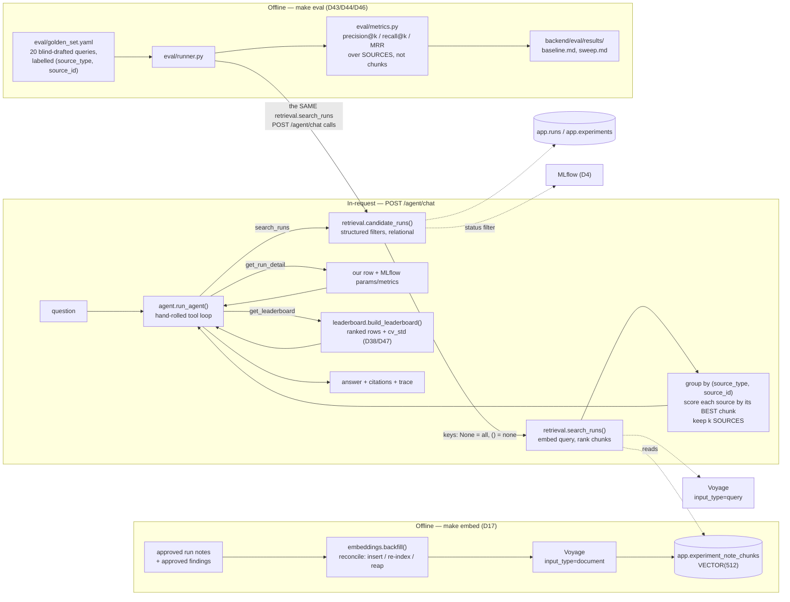
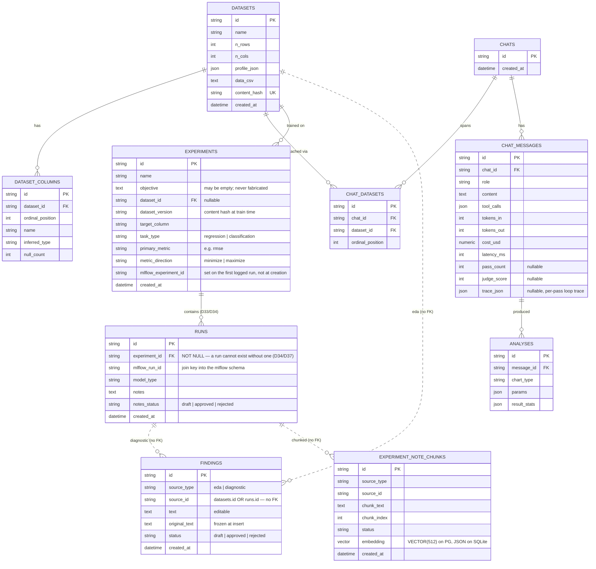

# Architecture Overview

This document is the single place to build a mental model of the ML Experiment
Tracker: what it does, why each major piece exists, how data moves through it,
and what you'd change if the requirements changed. It's written for a student
who hasn't read the code yet — by the end, you should be able to draw the
diagrams from memory and explain the trade-offs out loud.

If you want to *use* the system rather than understand its internals, read
[`doc/user-manual.md`](user-manual.md) instead. That document is task-oriented
("how do I train a model?"); this one is structural ("why is it built this
way?").

The authoritative list of numbered design decisions lives in
[`doc/project-1-csv-analysis-assistant-design.md`](project-1-csv-analysis-assistant-design.md)
(D1–D6), the two decisions that superseded/extended it —
[`doc/project-1-llm-loop-design.md`](project-1-llm-loop-design.md) (issue #9)
and
[`doc/project-1-multi-dataset-chat-design.md`](project-1-multi-dataset-chat-design.md)
(issue #6) — and, for Project 2's foundations,
[`doc/project-2-ml-experiment-tracker-design.md`](project-2-ml-experiment-tracker-design.md)
(**D1–D17 and D20**; it does *not* carry D18–D19 or D21–D48, despite what this
document said before 2026-08-30). Every later decision was taken inside a phase
and is defined in that phase's own design document:

| Decisions | Defined in |
| --- | --- |
| D18, D19, D21 | [`doc/plans/2026-08-10-project-2-phases-2-4-design.md`](plans/2026-08-10-project-2-phases-2-4-design.md) |
| D22–D27 | [`doc/plans/2026-08-14-project-2-phase-2b-eda-diagnostics-design.md`](plans/2026-08-14-project-2-phase-2b-eda-diagnostics-design.md) |
| D28–D32, D41–D42 | [`doc/plans/2026-08-25-project-2-phase-3-retrieval-agent-tracing-design.md`](plans/2026-08-25-project-2-phase-3-retrieval-agent-tracing-design.md) |
| D33–D40 | [`doc/plans/2026-08-22-project-2-experiment-run-hierarchy-design.md`](plans/2026-08-22-project-2-experiment-run-hierarchy-design.md) |
| D43–D48 | [`docs/superpowers/specs/2026-08-28-project-2-phase-4-design.md`](../docs/superpowers/specs/2026-08-28-project-2-phase-4-design.md) |

All of them are summarised, with the failure each one prevents, under
**Non-obvious design decisions** in [`CLAUDE.md`](../CLAUDE.md) — start there if
you only want to know what not to break. This document explains and illustrates
those decisions with diagrams; it does not replace them as the source of truth.

## 1. What this system does

The system has two halves, built in that order, sharing one database and one
LLM loop.

**The analysis half (Project 1).** Upload one or more CSVs. Start a chat over
them. Ask a question in plain English — *"is income correlated with age?"* —
and get back a chart, the underlying statistics, and an LLM-written
interpretation of what you're looking at. There's no generic code-execution
sandbox: Claude picks from a **fixed menu** of six pandas/matplotlib tools
(`histogram`, `scatter`, `correlation_matrix`, `compare`, `error_by_group`,
`line`), the backend validates every argument against the dataset's actual
schema before running anything, and the interpretation is graded by a second,
independent LLM call before it's shown to you.

**The experiment half (Project 2).** Point a model at one of those same
datasets and train it. Every run — its settings, its scores, the exact data
version it saw, and the fitted model itself — is logged to MLflow and
surfaced on a leaderboard. Optuna can search a model's settings across N
trials, logging every one. The system can then write up what it found (an EDA
summary for a dataset, a residual analysis for a run) using the same
judge-gated loop as the chat half — but that generated text is a **draft** until
a human approves it, because a later phase treats approved text as ground
truth.

Two properties hold across both halves and are worth stating up front, because
most of the design follows from them:

- **The model never runs arbitrary code.** It selects from fixed menus and the
  backend validates every argument before executing anything.
- **The model never gets the last word.** Chat answers are graded by a judge
  call; written-up findings are gated on human approval.

## 2. High-Level Architecture

The data store and the compute path are deliberately separate boxes: the
backend is the only thing that talks to either. The frontend never calls
Anthropic directly, never calls MLflow, and never sees a database connection
string.

Two things about this diagram surprise people:

- **Training is in-process and synchronous.** There is no job queue, no worker
  pool, no async task. `POST /experiments/{id}/train` fits the model inside the
  request and returns when it's done. This is a deliberate scope choice for a
  workshop-sized dataset (~224 rows); it is the first thing that would have to
  change for datasets where a fit takes minutes.
- **MLflow shares the Postgres server but not the schema.** `app` and `mlflow`
  are two schemas in one database. They are joined at the application level on
  `runs.mlflow_run_id`, never by a SQL join. §7 explains how that mapping now
  lines up directly with MLflow's own Experiment/Run split.

## 3. Tech Stack

| Layer | Technology | Why |
|---|---|---|
| Language (backend) | Python 3.12 | Typed, mature data/ML ecosystem (pandas, matplotlib); mypy strict catches contract drift early. |
| Web framework | FastAPI | Async-capable, Pydantic-native request/response validation, auto-generated `/docs`. |
| ORM | SQLAlchemy 2.0 | Typed `Mapped[...]` models catch column-type mistakes at the type-checker, not at runtime. |
| Migrations | Alembic | Versioned, reviewable schema changes on Postgres; `alembic upgrade head` at startup keeps prod self-healing. |
| Database | Postgres (`app` schema) in prod; SQLite in tests/local dev | Postgres for real concurrency and constraints; SQLite needs zero setup for a workshop laptop. |
| LLM | Claude, via the Anthropic Python SDK | Native tool-calling (function-calling) maps directly onto the fixed chart-tool menu. |
| ML | scikit-learn | Pipelines make the fit-on-training-folds-only guarantee structural rather than a thing you remember to do (see §7). |
| Experiment tracking | MLflow (Postgres backend store, `mlflow` schema) | Standard run/param/metric model plus artifact storage, so the fitted model can be re-loaded later instead of re-fitted (D24). |
| Hyperparameter search | Optuna | Define-by-run search spaces live next to the model spec in `MODEL_REGISTRY`, so adding a model adds its space too. |
| Vector column | pgvector (`VECTOR(512)`, `JSON` variant on SQLite) | Reserved for Phase 3 retrieval; the dialect split is what keeps the whole test suite runnable on SQLite. |
| Charting | matplotlib (`Agg` backend) + seaborn | `Agg` is non-interactive and thread-safe — required under a multi-worker web server; seaborn styles the fixed chart set. |
| Frontend | React 18 + Vite + TypeScript | Fast dev server with proxying; TypeScript keeps the API response shapes honest across the fetch boundary. |
| Frontend components | Radix UI primitives (`@radix-ui/react-dialog`) + hand-rolled CSS-variable design tokens | One real dependency for accessible primitives (focus trap, ARIA) the team won't reinvent; everything else is tokenized and owned. |
| Backend tests | pytest + httpx | `TestClient`-driven request/response tests against an isolated SQLite DB per test. |
| Frontend tests | Vitest + React Testing Library | Mocked `fetch`, assertions on roles/text/`data-*` (CSS modules aren't loaded in tests, so class names can't be asserted on). |
| Dependency management | Poetry (backend), npm (frontend) | Poetry pins a reproducible `poetry.lock`; npm is the frontend ecosystem default. |

## 4. Data & Process Flow

### 4.1 Upload flow

The raw CSV text is the *only* durable copy (D5) — there's no object store and
no parquet conversion. `profile_dataframe()` is deliberately bounded (§6 below)
because its output is what gets pasted into every LLM prompt for every turn of
every chat over that dataset; an unbounded profile would make token cost scale
with the dataset's cardinality, not with the conversation.

### 4.2 Chat flow — the judge-gated loop (issue #9)

This is the one part of the system that most looks like a single request but
runs multiple LLM calls in a loop. A **pass** is one analyst call + validation
+ rendering + one judge call.

Three things about this loop are easy to miss on a first read:

- **The judge scores the actual rendered output, not a prediction of it.** The
  analyst doesn't get to grade its own homework — the judge call only ever
  sees charts and stats that were really produced by really running the
  tools, after backend validation. This is the whole point of separating the
  two calls: it catches an analyst that describes a chart it didn't actually
  make, or hallucinates a trend the real data doesn't show.
- **The loop returns the best-scoring pass, not the last one.** If pass 2
  scores higher than pass 3, pass 2 wins. A later pass can make things worse
  (a bad revision instruction, a dropped chart) and the loop doesn't reward
  merely being the last to run.
- **The system prompt never leaves the backend.** Not in the response, not in
  the stored trace, no UI toggle. It's excluded by construction because it can
  contain guardrail language that shouldn't be exposed to end users. This is
  worth remembering if you're ever asked to "just also return the system
  prompt for debugging" — that request has already been considered and
  deliberately declined.

The loop stops on whichever comes first: the judge score clears
`Settings.llm_quality_threshold` (default 80), `Settings.llm_max_passes`
(default 3) is reached, or the pass **stalls** (adds no new charts and the
judge score doesn't improve on the best seen so far — no point burning another
pass on a plateau).

### 4.3 Training and tuning flow

`POST /experiments/{experiment_id}/tune` is the same flow wrapped in an Optuna
study: N trials, each one a full `fit_and_score` + `log_run`, returning every
trial plus the best. It is still synchronous inside the request. Both routes
resolve `dataset_id`, `dataset_version`, `target_column`, and `task_type` from
the parent Experiment rather than the request body (`time_column` stays
per-request, since which column is temporal can vary run to run) — a run cannot
exist outside an experiment (D34/D37), so "which dataset, which target" is not
repeated on every launch.

Four things here are load-bearing:

- **The route parses the CSV; `training.py` takes a DataFrame.** The training
  module knows nothing about HTTP or the database. This is what makes it
  unit-testable without a server, and it is why adding a new training input
  means uploading a dataset, never adding a file path to the request path
  (D13).
- **Encoding happens inside the pipeline, not before the split.** If you
  one-hot encode the full frame first, the encoder has seen the test rows'
  distribution and the model is leaking. The failure is invisible — every
  metric still looks plausible — which is exactly why it's structural here
  rather than a convention.
- **Temporal data splits chronologically (D18).** With `time_column` set, the
  holdout is the tail of the sorted frame and cross-validation is
  `TimeSeriesSplit`. The column is dropped from the features: it's the split
  axis, not a predictor. A misspelled `time_column` is a **422**, never a
  silent fallback to a random split — the leaky version returns 200 with
  flattering metrics and nothing downstream would notice.
- **Every metric carries its cross-validation standard deviation.** On a
  ~224-row panel, a difference smaller than the fold spread is noise. The API
  reports the spread so the leaderboard can't quietly present it as a win.

### 4.4 Generation and review flow

The two Phase 2b generation endpoints reuse the §4.2 loop, then park their
output behind a human gate.

- **The diagnostic loads the model that was scored; it never refits from logged
  params (D24).** A close-but-different model reported as the one that was
  scored is the worse failure, because nothing about it looks wrong.
- **Derived frames are never persisted.** `datasets` is the single *source*-data
  path (D13), and a residual frame is not source data.
- **Neither generation endpoint wraps `run_loop` in a try/except.** The "no
  partial finding" guarantee comes from **statement ordering** —
  `create_finding` sits below the loop call — matching what `routes/chats.py`
  already does. Keep that ordering if you refactor.
- **Generated text is a draft (D20/D22).** Only an explicit
  `status`/`notes_status` in a PATCH promotes it. Writing text through the same
  route is deliberately *not* an approval, so the seeding script cannot
  approve its own output.

### 4.5 Retrieval, the agent, and the eval harness (Phases 3-4)

Three paths, and the important thing about the diagram is that indexing and
asking are **not connected in real time**. Indexing happens offline; asking
happens in a request. Text approved since the last `make embed` is invisible to
the agent. The third path, `make eval`, is offline too — and it enters the
request path's own retrieval rather than a copy of it.

Why it is shaped this way:

- **Two stages, structured first (D15/D31).** Filters that have a relational
  answer — model type, dataset, task type, investigation — are answered in SQL,
  not by hoping the vector search happens to respect them. `status` has no
  relational column (it lives in MLflow, D4), so it intersects with the tracking
  store; an unreachable one **drops that one filter with a warning** rather than
  503ing, because notes and findings are in Postgres and stay answerable.
- **An empty candidate set is not an unrestricted one.** `keys is None` means "no
  filters were given, search everything"; `keys == ()` means "filters were given
  and matched nothing". Collapsing them turns "no ridge runs exist" into "here is
  everything", which the agent then summarises with total confidence.
- **`k` counts sources, not chunks.** Chunks are the retrieval unit; sources are
  the answer unit. Otherwise one long finding fills the budget and hides three
  other runs, and every hit cited is genuinely relevant, so nothing looks wrong.
- **The two Voyage calls are asymmetric.** `input_type="document"` when indexing,
  `"query"` when searching. Voyage's models are trained with that asymmetry, and
  getting it wrong costs recall with no symptom but mediocre numbers.
- **The agent's turn cap does not end the request empty-handed.** After
  `AGENT_MAX_TURNS` tool-calling turns the loop makes one further call with the
  tools removed, so the user gets an answer rather than an empty string.
- **A third tool, named for what it returns (D47).** "What should I try next?"
  is a question about *rankings*, and snippets retrieved by similarity are prose
  *about* runs — they cannot be ordered. `get_leaderboard` hands the model the
  same ranked rows and `cv_std` bands `GET /experiments/{id}/runs` serves, so a
  recommendation is grounded in the leaderboard rather than in whichever note
  happened to rank first. It is not called `recommend_next`: a tool named for
  the conclusion gets its output treated as the recommendation rather than as
  the evidence for one.
- **The eval harness reads through the production path, on purpose.**
  `eval/runner.py` calls the same `retrieval.search_runs` the agent's tool does
  — the arrow into the diagram's `candidate_runs` is not a shortcut in the
  drawing. A harness with its own retrieval would measure a reimplementation
  that can drift from what ships, which is the one thing about an eval that must
  not be true. It grades **retrieval only** and never answer quality: an
  LLM-judged answer grade would put Claude on both sides of the scoring, which
  is the circularity D44 exists to break.

## 5. Data Model

Notes that explain *why* it looks like this, not just what it is:

- **No `users` table, anywhere (D4).** A dataset's `id` and a chat's `id` are
  each their own shareable link. There's no login, no session, no per-user
  scoping. This began as a Project-1 boundary on the assumption that Project 2
  would add auth; Project 2 **reaffirmed the decision instead** (its D2), so
  there is still no `User` model or FK, and neither `experiments` nor `runs`
  has an owner column.
- **`chats` has no `dataset_id` column.** A chat spans *N* datasets through the
  `chat_datasets` join table (issue #6), fixed at chat creation — there's no
  mid-chat "attach another dataset." `ordinal_position` preserves the order
  they were passed in, since that order matters for the `compare` tool (it
  always compares exactly two datasets and needs a stable "first" vs.
  "second").
- **Charts are never stored as rows or files.** There's no `chart_urls`
  column and no image directory on disk. A chart is a pure function of
  `data_csv` + a message's `tool_calls`; on every history read
  (`GET /chats/{id}`), the backend re-renders from those two inputs. The one
  deliberate exception is `chat_messages.trace_json`, which *does* store
  rendered PNGs per pass — accepted because the trace UI needs to show
  exactly what the judge saw, and re-rendering intermediate (non-final)
  passes on every reload would be wasted work for something users rarely
  expand.
- **`pass_count` / `judge_score` / `trace_json` are all nullable** because
  rows predating the loop (or, rarely, a turn where every judge call failed)
  never populated them.
- **`findings.source_id` has no foreign key, on purpose (D22).** It addresses
  *two* tables — `datasets.id` when `source_type = "eda"`, `runs.id`
  when `"diagnostic"` — and no single FK can express that. `app/findings.py`
  validates the reference at write time instead. This is a real trade-off: the
  database will not stop you inserting a dangling `source_id` if you bypass
  that module, which is one more reason scripts go through the API rather than
  writing rows directly.
- **`findings.original_text` is frozen at insert and never rewritten.** It's
  the left-hand side of the draft-vs-edit diff a reviewer sees. Without it, the
  moment a reviewer saved an edit, the original would be gone and there'd be no
  way to see what the model actually proposed.
- **`runs.notes` was deliberately *not* folded into `findings`.**
  Uniformity would have been nicer, but it would have meant migrating 32 live
  drafts and breaking a route that had just shipped. Phase 3 reads both sources
  with a UNION instead. (Written when `runs` was still named `experiments`
  (D33) — the notes column made the same trip under the rename.)
- **Neither `experiments` nor `runs` has an owner column**, for the same reason
  there's no `users` table — see D4/D2 above.
- **No MLflow table is modelled here.** MLflow owns its own schema and its own
  migrations; the app joins to it in application code on `mlflow_run_id`. §7
  explains what goes wrong if you forget that.

## 6. Interface Contracts

### REST API surface

| Method | Path | Request | Response | Notes |
|---|---|---|---|---|
| GET | `/health` | — | `{"status": "ok"}` | Liveness only. |
| POST | `/datasets` | multipart `file` | `DatasetOut {id, name, n_rows, n_cols}` | 400 on unparseable/empty CSV or non-`.csv` name; 413 over size/row caps; idempotent by content hash. |
| GET | `/datasets` | — | `list[DatasetOut]` | Newest first; column-projected query (never hydrates `data_csv`/`profile_json` on this hot path). |
| GET | `/datasets/{id}` | — | `DatasetDetailOut` | Adds `columns` (the profiled schema) to what the list route returns; the run form's column pickers read it. 404 if missing. |
| POST | `/chats` | `{"dataset_ids": [str, ...]}` | `ChatOut {id, datasets: [{id, name}]}` | 400 if empty; 404 if any dataset id is unknown. |
| POST | `/chats/{id}/messages` | `{"question": str}` | `ChatMessageOut {id, role, content, charts, stats, errors, trace}` | Runs the full judge-gated loop; can take longer than a single API call. |
| GET | `/chats/{id}` | — | `ChatHistoryOut {datasets, messages}` | Re-renders charts from `tool_calls` on every call; the stored `trace_json` (if present) is returned verbatim. |
| POST | `/datasets/{id}/eda` | **no body** | `FindingCreatedOut {finding_id, source_type, source_id, status, text}` | Runs the loop; creates a `draft` EDA finding. 404 on unknown dataset. |
| POST | `/experiments` | `{name, target_column, objective?, dataset_id?, dataset_version?, task_type?}` | `ExperimentOut {id, name, objective, dataset_id, dataset_version, target_column, task_type, primary_metric, metric_direction, n_runs, created_at}` | Creates the investigation a run must belong to (D34/D37). 404 if `dataset_id` is set but unknown. `primary_metric`/`metric_direction` are derived from `task_type`, not client-supplied. |
| GET | `/experiments` | `?dataset_id=&task_type=` | `list[ExperimentOut]` | Newest first. |
| GET | `/experiments/{id}` | — | `ExperimentOut` | 404 if missing. |
| PATCH | `/experiments/{id}` | `{name?, objective?}` | `ExperimentOut` | Renaming/re-scoping only — `dataset_id`/`target_column`/`task_type` are fixed at creation. |
| GET | `/experiments/{id}/runs` | — | `LeaderboardOut {primary_metric, metric_direction, ranked, mlflow_available, rows: [{run, rank, value, cv_value, cv_std, is_best, within_noise}]}` | The leaderboard — runs ranked **within this experiment only** (D38), never across experiments with unrelated metrics. Falls back to unranked, newest-first when MLflow is unreachable. |
| GET | `/models` | — | `list[ModelSpecOut]` | Serializes `MODEL_REGISTRY`: each model's `task_type`, `tunable`, numeric `hyperparams`, and `column_hyperparams`. Exists so the run form never restates the registry (#52). |
| POST | `/experiments/{id}/train` | `{model_type, hyperparams?, feature_columns?, time_column?, notes?}` | `RunOut {run_id, mlflow_run_id, status, task_type, metrics}` | Synchronous fit inside the experiment; `dataset_id`/`target_column`/`task_type` are inherited from the parent, never repeated in the request. 422 on unknown model/`time_column`. |
| POST | `/experiments/{id}/tune` | `{model_type, n_trials=20, feature_columns?, time_column?, notes?}` | `TuneOut {n_trials, task_type, objective_metric, direction, best_run_id, best_metrics, trials[]}` | Optuna study, still synchronous, one logged run per trial. **422 on `persistence`** — its search space is empty, so N trials would be N identical runs. |
| GET | `/runs` | `?model_type=&task_type=&dataset_id=&experiment_id=&notes_status=&status=` | `list[RunDetailOut]` | `task_type`/`dataset_id` filters join through the parent experiment. Reads N runs in **one** `search_runs` call, not N+1. |
| GET | `/runs/{id}` | — | `RunDetailOut` | Includes `mlflow_available`, so the UI can degrade when the tracking store is down rather than erroring. |
| PATCH | `/runs/{id}` | `{notes?, notes_status?}` | `RunDetailOut` | Notes text alone is **not** an approval. Approving empty notes is a 422; rejecting them is allowed. |
| POST | `/runs/{id}/diagnostics` | **no body** | `FindingCreatedOut` | Loads the logged model. **409** if the artifact is missing; 409 if the parent experiment's `task_type` is not `regression` (residuals are undefined for a classifier). |
| GET | `/findings` | `?status=&source_type=` | `list[FindingOut]` | The review queue's data source. |
| PATCH | `/findings/{id}` | `{text?, status?}` | `FindingOut` | Same draft/approval rule as runs; `original_text` is never overwritten. |
| POST | `/agent/chat` | `{question}` | `AgentChatOut {answer, retrieved[], trace, tokens, cost_usd}` | Stateless and mounted at `/agent`, not under `/experiments` — the agent answers *across* investigations (D42). `extra="forbid"`, so a client that thinks it is continuing a conversation gets a 422 rather than having its `chat_id` silently ignored. No `system_prompt` field, same as the loop trace. |

Both generation endpoints take **no request body** (D23) — everything is
derived from the stored row. There is nothing to pass and therefore nothing to
validate, which is the cheapest possible way to make an endpoint hard to
misuse.

### Internal interfaces worth knowing by name

- `profile_dataframe(df, *, sample_rows, max_cardinality, max_corr_cols, top_corr_pairs, token_budget) -> dict` (`app/profiler.py`) — the bounded profile Claude actually reads. Returns `degraded=True` and falls back to schema + `describe()` + correlations only if the full profile would exceed `token_budget`.
- `validate_tool_call(call, profiles) -> ValidatedCall | ToolError` (`app/tools.py`) — checks a Claude-proposed tool call's dataset id, column names, and types against the real profile before anything touches pandas. Never trust raw model output.
- `run_loop(dataset_infos, dataframes, prior_messages, question) -> LoopResult` (`app/loop.py`) — the orchestrator described in §4.2; returns the best-scoring pass plus the full per-pass `trace`.
- `fit_and_score(model_type, hyperparams, df, target, features, time_column=None) -> TrainResult` (`app/training.py`) — the whole training path in one call. Takes a **DataFrame**, never a path.
- `MODEL_REGISTRY: dict[str, ModelSpec]` (`app/training.py`) — each spec carries its estimator factory, its Optuna search space, its `cv_scoring` string, and a `preprocess` flag. **Adding a model means adding a spec, not editing the route.**
- `log_run(...) -> str` / `fetch_runs(run_ids) -> dict` (`app/experiment_log.py`) — the only two places MLflow is written and read. `fetch_runs` is one `search_runs` call for N ids.
- `residual_frame(...)` / `learning_curve_frame(...)` (`app/diagnostics.py`) — derive diagnostic frames from the run's *own* split; never refit.
- `create_finding(...)` / `list_findings(...)` / `update_finding(...)` (`app/findings.py`) — the only writer of `findings`; validates `(source_type, source_id)` against the right table and freezes `original_text`.
- `search_runs(question, filters, k, ...) -> list[Hit]` / `get_run_detail(run_id)` (`app/retrieval.py`) — two-stage retrieval. `k` counts **sources**, not chunks, and a source scores by its single nearest chunk. The eval harness calls this same function, not a copy of it.
- `run_agent(question, session) -> AgentResult` (`app/agent.py`) — the hand-rolled Anthropic tool loop, deliberately **not** `run_loop`. `TOOLS` carries **three** tools — `search_runs`, `get_run_detail` and `get_leaderboard` (D41/D47) — and `prompts/agent.md` must name the same three: the prompt is part of the tool contract, and it drifted to saying two when the third landed (fixed in `0697cb6`).
- `build_leaderboard(session, experiment_id) -> LeaderboardOut` (`app/leaderboard.py`) — the route handler's body, extracted so the agent tool reaches identical ranking without importing `HTTPException`. Raises `ExperimentNotFound`, a `LookupError`.
- Frontend `api.ts` — `uploadDataset()`, `listDatasets()`, `getDataset()`, `createChat()`, `getChat()`, `postChatMessage()`, plus the experiment/run surface added this branch: `listExperiments()`, `createExperiment()`, `getExperiment()`, `updateExperiment()`, `getLeaderboard()`, `listRuns()`, `getRun()`, `updateRun()`, `runDiagnostics()`, `listModels()`, `trainRun()`, `tuneRun()`, `askAgent()` — thin `fetch` wrappers whose return types are the same `*_Out` shapes the backend's Pydantic schemas define, kept in sync by hand in `frontend/src/types.ts`.

## 7. Integration Patterns

**LLM tool-calling, twice, for different purposes.** The analyst call gets a
tool schema built from a **fixed menu** (`histogram`, `scatter`,
`correlation_matrix`, `compare` — see `app/tools.py`); Claude's response is
parsed for `tool_calls`, each one validated against the real dataset profile,
then executed. The judge call is a *different* tool-calling use: it's forced
to call a single `submit_verdict` tool (see `prompts/judge.md`) so its score
and feedback arrive as structured data, not prose that would need parsing.

**Profiler token-budget degradation.** `profile_dataframe()` enforces caps —
`value_counts` only for columns with cardinality ≤ `profile_max_cardinality`,
correlations capped at `profile_top_corr_pairs` beyond
`profile_max_corr_cols` numeric columns, `profile_sample_rows` sample rows —
and if the assembled profile still exceeds `profile_token_budget`, it degrades
to schema + `describe()` + correlations only. In multi-dataset chats, this
budget is checked against `profile_token_budget * n_datasets`, degrading
`sample_rows` first across all datasets before falling back further.

**matplotlib `Agg`, fresh `Figure` per call.** The analysis engine
(`app/analysis.py`) never touches `pyplot`'s global state — it isn't
thread-safe under a multi-worker FastAPI process. Every chart function creates
its own `Figure`, renders to it, and closes it, so concurrent requests can
never bleed into each other's plots.

**SQLite in tests, Postgres in prod, one code path.** The `client` pytest
fixture (`conftest.py`) overrides the `get_session()` FastAPI dependency with
an isolated, ephemeral SQLite session per test — no shared state between
tests, and no mocking of the ORM layer itself. Production wires the same
`get_session()` to a real Postgres engine via `DATABASE_URL`. `init_db()`
branches once, at startup: `alembic upgrade head` for Postgres,
`Base.metadata.create_all()` for SQLite.

**MLflow owns its schema; Alembic must never see it.** The tracking store
shares the app's Postgres server but lives in the `mlflow` schema.
`backend/alembic/env.py` runs with `include_schemas=True`, so without the
`app_schema_only` `include_object` filter, `--autogenerate` proposes dropping
every MLflow table — 59 of them at the pinned version. Before this branch,
MLflow's own `experiments` table and `app.experiments` were namesakes that
diverged in meaning: every run this app logged, from every dataset and model
type, landed in one MLflow `adhoc` experiment (or a one-off
`tune-<model>-<timestamp>` experiment per Optuna study), while one
`app.experiments` row was a single training run. **As of D33, they correspond
directly** — deleting the `ADHOC_EXPERIMENT` fallback and nesting
`train`/`tune` under `POST /experiments/{id}` (D35, D37) means one
`app.experiments` row now creates (or reuses) one MLflow experiment named
after it, and every `app.runs` row is one MLflow run inside it. A run cannot
be logged without an experiment to inherit its MLflow experiment from.
`runs.mlflow_run_id` is still the only join key (never a SQL join across
schemas), but `app.experiments` and `mlflow.experiments` now mean the same
thing, not just share a name. Never model an MLflow table in `app/models.py`.

**A non-sklearn estimator must be declared to skops.** `log_run` passes an
explicit `skops_trusted_types` to `mlflow.sklearn.log_model`; MLflow 3.15
serialises with skops, which refuses to save any type not on that list (safer
than pickle, which executes arbitrary code on load). Add a `MODEL_REGISTRY`
entry whose estimator is one of our own classes *without* adding it to the
trust list and every run of that model **500s at log time** — and only against
a real tracking store, so unit tests on the SQLite store stay green. This
actually happened with `PriorValueRegressor`. The fix that matters isn't the
one-line addition, it's `test_every_registry_model_logs`, which parametrizes
over `MODEL_REGISTRY` and both logs *and* loads each entry, so any future
model is covered automatically.

**The persistence baseline is a registry entry, not a number in prose (D25).**
`MODEL_REGISTRY["persistence"]` fits `PriorValueRegressor`, whose `predict`
returns `X[prior_column]` unchanged — so "guess the same as last time" competes
on the leaderboard like any other model, and Phase 3 can retrieve it. It
requires `ModelSpec.preprocess = False`: inside the standard pipeline the
estimator would receive a **scaled** prior value and emit plausible-looking
nonsense rather than fail. This baseline is what produced the phase's headline
result — across 25 runs on the revenue panel, **nothing beat it**.

**Backend validates before executing, always.** Every tool call Claude
proposes is checked against the dataset's actual profiled columns and types
before it reaches a pandas/matplotlib function. A mismatched column name or
type produces a graceful per-call error entry in the response — it never
raises inside the analysis engine, and raw model output is never passed
through unchecked.

## 8. Key Design Decisions

Format: **Context → Decision → Trade-offs → When to revisit.**

**D2 (superseded) — from single-pass to a judge-gated loop.**
*Context:* the original design ran one LLM call that picked tools, wrote
prose, and had no way to check its own work. *Decision:* replaced with the
loop in §4.2 — a separate judge call scores the analyst's actual rendered
output and the loop retries with feedback until a quality bar is cleared or a
pass cap is hit. *Trade-offs:* a chat turn can now take several times longer
and cost several times more tokens than a single call, in exchange for
catching hallucinated or mismatched interpretations before the user sees them.
*When to revisit:* if latency/cost becomes the binding constraint over
answer quality, consider lowering `llm_max_passes` or raising
`llm_quality_threshold` less aggressively — or moving the judge to a cheaper
model via `JUDGE_MODEL`.

**D4 — no auth, no `users` table.**
*Context:* Project 1 is single-workshop, single-tenant. *Decision:* a
dataset/chat `id` is its own access control — anyone with the link can view
or continue it. *Trade-offs:* zero login friction for a workshop, zero data
isolation between anyone who has (or guesses) an id. *When to revisit:* this was
expected to be the Project 2 fork, but Project 2 reaffirmed single-tenancy (D2)
rather than adding auth — so the revisit has been deferred again, and there is
still no `User` model or FK anywhere in the codebase. Do not add one.

**D5 — raw CSV in Postgres, no object store.**
*Context:* uploaded data needs one durable, queryable-adjacent home.
*Decision:* store the decoded CSV verbatim as `Text` in `datasets.data_csv`;
`load_csv()` is the single parser used at both upload-time profiling and
later chart re-render, so both stages see identical dtypes. *Trade-offs:* no
compression (a 50 MB upload stays ~50 MB in the database) and no S3/GCS
tier, bounded by `MAX_UPLOAD_BYTES`. *When to revisit:* if upload sizes grow
past what's comfortable to keep in Postgres text columns, or if the
ephemeral-filesystem constraint of the target deploy platform changes.

**D6 — eval suite kept separate from unit tests.**
*Context:* grading whether an LLM's answer is *good* (not just
well-typed) requires real API calls at real cost, which offline unit tests
must never depend on. *Decision:* `make eval` hits the real Anthropic API at
temperature 0 against a fixed golden question set and grades tool selection,
column choice, and interpretation keyword presence — kept out of `make test`
and `make check` entirely. *Trade-offs:* the eval suite costs money and time
to run, so it isn't part of CI's default gate. *When to revisit:* `make eval`
is currently a stub (prints a message only) — a later plan authors the real
suite; see the write-up in `CLAUDE.md`.

**Issue #6 — multi-dataset chat via a join table, not a `dataset_id` column.**
*Context:* users wanted to ask cross-dataset questions (e.g., compare two
CSVs) without redesigning what a "chat" is. *Decision:* `chat_datasets` joins
chats to N datasets, fixed at creation; a `compare` tool does an in-memory
inner-join aggregation across exactly two of them. *Trade-offs:* no mid-chat
"attach a dataset" — you start a new chat instead. *When to revisit:* if a
workflow genuinely needs mid-conversation dataset attachment, this is the
seam to redesign.

**Issue #9 review — the loop trace is exposed in the UI, system prompt is not.**
*Context:* reviewers wanted visibility into *why* a given pass scored the way
it did, not just the final answer. *Decision:* `run_loop()` returns a
per-pass trace (analyst interpretation, judge score/feedback/gaps, rendered
charts, the revision instruction fed to the next pass); the frontend renders
it as a collapsible block per pass. *Trade-offs:* this is the one deliberate
exception to "charts are never stored" — trace PNGs *are* persisted verbatim,
accepted for the storage cost. The system prompt is never included, by
design — it can leak guardrail language. *When to revisit:* if trace storage
cost becomes material, consider pruning older non-winning passes' PNGs
instead of exposing the system prompt as a trade-off — those are separate
concerns and shouldn't be conflated.

**D13 — one source-data path: the `datasets` table.**
*Context:* real source data arrives as ~50 committed CSV snapshots across 12
sources, and it would be easy to let training read one off disk. *Decision:*
joining, coercing, and labelling happen **offline** in
`scripts/prepare_dataset.py`; the results are uploaded through `POST /datasets`
like any other file. Nothing downloads at run time and nothing reads a CSV off
disk at request time. *Trade-offs:* adding a training input takes two steps
(prepare, then upload) instead of one. *When to revisit:* if datasets outgrow
what's comfortable in a Postgres text column — the same threshold as D5.

**D18 — temporal data splits chronologically, and a bad `time_column` is a 422.**
*Context:* the revenue panel is a time series; a random split lets the model
see the future. *Decision:* tail holdout + `TimeSeriesSplit` when
`time_column` is present; the column is dropped from features; a typo is a hard
422. *Trade-offs:* callers must know their data is temporal and say so — the
system can't infer it safely. *When to revisit:* if automatic detection ever
becomes reliable enough to trust, which it currently isn't.

**D20/D22 — generated text is a draft until a human approves it.**
*Context:* Phase 4's eval harness will treat approved text as known-relevant
ground truth. Machine-written text that approves itself corrupts that
measurement silently. *Decision:* both flows create `draft` rows; only an
explicit status change promotes them, and writing text is never an approval.
Findings live in their own table keyed by `(source_type, source_id)`.
*Trade-offs:* a human is now in the critical path for anything Phase 3 will
retrieve. That's the point. *When to revisit:* not before there's a measured
baseline for how often the generated text is actually wrong.

**D24 — diagnostics load the logged model; a missing artifact is a 409.**
*Context:* it's tempting to re-fit from logged params when the artifact is
missing. *Decision:* never. `mlflow.sklearn.load_model` or fail loudly.
*Trade-offs:* a run whose artifact was pruned can't be diagnosed at all.
*When to revisit:* only alongside an artifact retention policy — the failure
mode being avoided (a close-but-different model reported as the one that was
scored) is worse than the outage, because nothing about it looks wrong.

**D26 — approval happens beside the write-up (originally: a gated bulk queue).**
*Context:* a "select all → approve" button on a review queue is a rubber-stamp
machine. *Original decision:* a row's approve checkbox was enabled only after
that row had been expanded in the current session. *Superseded:* the standalone
`/review` queue is gone. Findings are reviewed inline, on the page for the thing
they are about — EDA under the dataset, a run's diagnostic under the leaderboard
— each rendered in full next to its own Approve button, one at a time. The
property the gate was buying (approval only of text that was actually rendered)
now holds by construction rather than by tracking which rows were opened.
*Trade-offs:* reviewing a large backlog now means visiting several pages; that
cost was accepted because the batch surface was the hazard. *When to revisit:*
if the eval harness shows approved text is still unreliable, the next lever is a
stronger per-finding gate (requiring an edit, or an explicit confirmation) — not
a return to batch approval.

**D33/D34/D38 — an experiment is an investigation, and a run belongs to one.**
Before this, one row in `app.experiments` was one training run. It now names an
investigation, and the runs live in `app.runs` with a `NOT NULL`
`experiment_id`. The comparable fields — `dataset_id`, `dataset_version`,
`target_column`, `task_type` — moved up to the parent, so every run inside an
investigation is comparable by construction rather than by convention. The
leaderboard (`GET /experiments/{id}/runs`) ranks on the **holdout** metric, not
the cross-validated one, and reports a win smaller than the leader's `cv_std`
as "within noise".

*Trade-offs:* it cost a three-step migration chain (rename → add parent →
contract), and every document written before 2026-08-22 uses "experiment" in
the old, single-run sense. Ranking on the holdout metric is the weaker
statistic, but `cv_rmse` is absent on the persistence baseline, so ranking on
it would drop the baseline off the leaderboard that exists to anchor it.

*When to revisit:* only if runs need to be compared *across* investigations,
which would push the comparable fields back down onto the run.

## 9. Learning Checkpoints

After reading this document, you should be able to answer each of these
without looking anything up:

1. Walk me through what happens, component by component, when a user uploads
   a CSV.
2. Why does the profiler have a token budget, and what does it do when the
   profile would exceed it?
3. What would break if the backend stored rendered chart images as files
   instead of re-rendering them from `tool_calls` on every history read? Why
   is the loop trace a deliberate exception to that rule?
4. Why does the system run *two* separate LLM calls per pass instead of one,
   and what does the judge call actually see?
5. Why does the loop return the best-scoring pass instead of the last pass
   run?
6. What are the three conditions that stop the loop, and what does "stalled"
   mean in that context?
7. Why is there no `dataset_id` column on `chats`, and what does
   `chat_datasets.ordinal_position` protect?
8. What would you need to add to support user accounts, and why did Project 2
   decline to add them?
9. Why does `app/training.py` take a DataFrame instead of a dataset id or a
   file path, and what does that buy you when testing?
10. What exactly goes wrong if you one-hot encode the whole frame before
    splitting, and why won't the metrics tell you?
11. Why is a misspelled `time_column` a 422 rather than a fallback to a random
    split?
12. Why does `findings.source_id` have no foreign key, and what enforces
    referential integrity instead?
13. Why is the persistence baseline a `MODEL_REGISTRY` entry rather than a
    number quoted in a document — and what did having it as a real run reveal?
14. Why does `POST /experiments/{id}/diagnostics` load the saved model instead
    of re-fitting from the logged parameters?
15. What breaks if you add a model whose estimator is your own class and forget
    the skops trust list — and why would the unit tests still pass?
16. D26 originally gated bulk approval on having opened the row. What property
    was that buying, and how does reviewing findings inline give you the same
    property without tracking anything?
